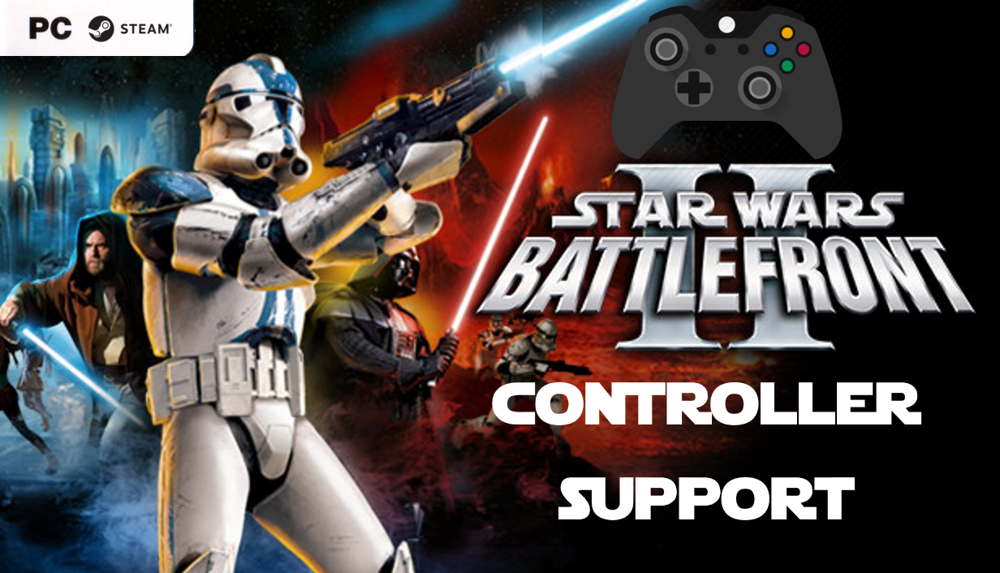

# Repository
https://github.com/BAD-AL/data_UOP_controller_patch

## Works with
* XBOX Controllers
* Steamdeck main controller
* Stadia Controller

Note: People have mentioned trouble with Dual Shock 4 controller.

https://youtu.be/pz5e2ZpOyVw

## About
In February 2021 There was an Update to Star Wars Battlefront II on Steam.
The release added native controller support to the Steam version of the Game.

The update was reverted the next day due to bugs and incompatibilities with the un-official patch. 
I've been tinkering with that release and have gotten it into a functional state with the un-official patch.

## Mapping Roll (Via Steam Input)
1. Enable Steam Input
2. Select 'Gamepad' as the Current Button Layout
3. Edit Layout
4. 'B' Button ➤ Add Command (Select 'Alt' key)
5. 'B' Button 'Command 2' ➤ settings ➤ 'Double Press'

Now the 'Roll' will happen when you quickly double press the 'B' Button. (Thanks to  bleppyboo from YouTube comments)

## Mapping Roll & Droidika Transform via Profile Editing 
I created a Profile editor tool that will allow you to edit some of the Controller functions.

Download the program exe 
[here](https://github.com/BAD-AL/data_UOP_controller_patch/blob/main/BF2_Steam_Controller_Profile_Config/bin/Debug/BF2_Steam_Controller_Profile_Config.exe):

It is a '.NET Framework' app, it should work under 'mono' as well.

To use it, double click to launch, select profile and edit profile manuallt or press the 'auto fix' button, then save and exit the program.

Thanks to Ivanproff for the [info mentioned here](https://github.com/BAD-AL/data_UOP_controller_patch/issues/3) :)

## Known bugs:
 * Mouse doesn't work to select planets in galactic conquest. Workaround - use the dpad or left thumbstick instead.
 * (with UOP Galactic Conquest) Default units sometimes replaced with units from a GC mod 

## Compatibility
 * Steam Game version only. Will not work with any other version of the game. Needs a legal license from Steam, they know what you own and won't let you play unless you own it.
 * You must already own the game on steam in order to use this package. If you do not own the Steam version, then buy it.

 ## Install
  1. Download the latest version from the release section of the repo.
  2. Backup your files (see the notes below to see which files to backup).
  3. Unzip the release package, copy and paste the 'GameData' folder over your 'GameData' folder.
  4. The following files/folders will be added:
 * GameData/addon/000
 * GameData/addon/AAA-v1.3patch (no changes from the un-official patch release)
 * GameData/data/_lvl_pc/custom_gc_10.lvl
 * GameData/data/_lvl_pc/user_script_10.lvl
 * GameData/data/_lvl_pc/v1.3patch_strings.lvl ( this is modified, adds more strings than the uop)
  5. The following files will be overwritten (so back these up):
 * GameData/BattlefrontII.exe
 * GameData/alsoft.ini
 * GameData/Galaxy.dll
 * GameData/OpenAI32.dll
 * GameData/steam_api.dll
 * GameData/data/_LVL_PC/movies/pre-movie.mvs
 * GameData/data/_LVL_PC/movies/shell.mvs
 * GameData/data/_LVL_PC/load/load.lvl
 * GameData/data/_LVL_PC/load/common.lvl
 * GameData/data/_LVL_PC/common.lvl
 * GameData/data/_LVL_PC/core.lvl
 * GameData/data/_LVL_PC/ingame.lvl
 * GameData/data/_LVL_PC/shell.lvl

## BF2 Modder
 * BAD_AL

## Special Thanks
 * Pandemic for this awesome Game and modtools
 * Disney for continued support
 * GT-Anakin for reverse-engeneering many of the UOP Lua files
 * Zerted for the original UOP.
 * Kade for inspiring me to return/fixup the menus
